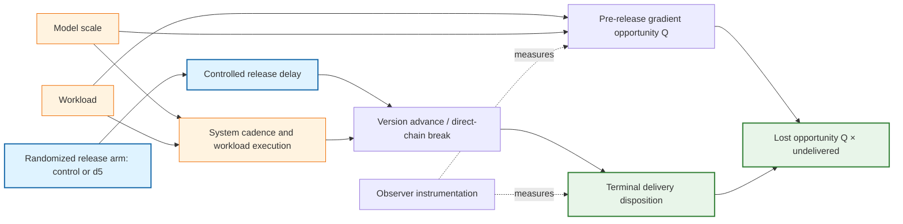

# Causal diagram

The release arm is assigned from the frozen assignment domain before release.
Opportunity \(Q\) is recorded before the delay and therefore cannot be caused by
the assignment. The estimand compares arm-specific lost-opportunity means,
normalized by pre-delay opportunity. Model and workload are fixed cell-level
contexts rather than randomized treatments; their interaction is consequently
a contrast among the six tested Qwen environments, not a family-wide causal
effect. The Llama extension repeats the randomized within-cell contrast in a
second family, but family itself is not randomized and must not be interpreted
as the causal exposure in this diagram.
