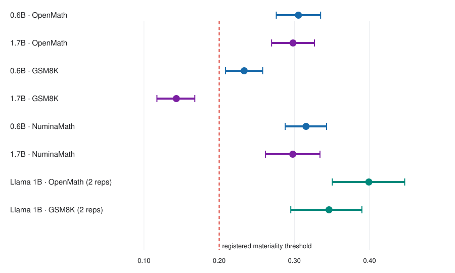
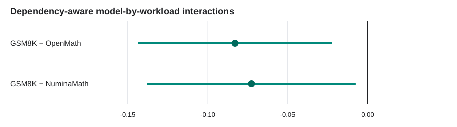

# Measuring the causal cost of delayed rollout release in asynchronous LLM reinforcement learning

Anonymous authors

## Abstract

Asynchronous reinforcement learning improves accelerator utilization by
overlapping rollout generation and policy updates, but delay can cause a
rollout to miss a gradient opportunity before it reaches the learner. Existing
measurements often conflate naturally slow examples, policy evolution, and
scheduling delay. We introduce M4, a controlled-release instrument that records
each rollout group's pre-release gradient opportunity, randomizes an additional
zero- or five-second release delay, follows terminal delivery, and audits the
proposed version-advance mechanism. The design combines a common opportunity
ledger, sharp terminal-missingness bounds, cross-fitted pre-treatment
adjustment, version-clustered HAC inference, circular-block bootstrap inference,
and explicit observer-duty accounting.

An initial 224-step acquisition validated the instrument and replicated the
mechanism, but its interval crossed a prespecified normalized materiality
threshold of 0.20. A prospectively redesigned 448-step Qwen3-0.6B/OpenMath
follow-up estimated normalized opportunity loss of 0.305 (95% conservative
envelope [0.276, 0.335]), entirely above the threshold. We then completed a six-cell grid
covering Qwen3-0.6B and Qwen3-1.7B on OpenMath, GSM8K, and NuminaMath. The six
definitive acquisitions contain 49,153 primary assignments; five intervals lie
above the threshold, while the positive Qwen3-1.7B/GSM8K interval lies entirely below it.
Two prospectively defined model-by-workload contrasts have the same direction.
A retrospective synthesis that accounts for their shared GSM8K anchors finds
correlation 0.38–0.41, simultaneous intervals that exclude zero, and a global
heterogeneity test of χ²(2)=11.53 (p=0.00314). The direct-chain and
version-advance mechanism replicates in every terminal cell. A preregistered
cross-family extension then ran two Llama 3.2 1B acquisitions per workload.
Equal-replicate estimates were 0.399 on OpenMath (envelope [0.350, 0.447]) and
0.346 on GSM8K ([0.295, 0.390]); both intervals were above 0.20. A prospectively frozen
Llama 3.2 3B size extension added four acquisitions. OpenMath was 0.262
([0.221, 0.299]), with its interval above 0.20; GSM8K was 0.214
([0.187, 0.240]), with its interval crossing 0.20. Prespecified 3B-minus-1B contrasts were negative on both
workloads, with simultaneous intervals excluding zero. The 14 definitive
acquisitions contain 106,653 primary assignments. These findings establish a
positive, heterogeneous opportunity-loss effect that exceeds the prespecified
threshold in most tested asynchronous GRPO environments. A separate prospective 16-pair experiment estimated the
total effect of mixed-d5 versus immediate release on terminal OpenMath accuracy
as -0.0449 (paired 95% CI [-0.1339, 0.0441]). The interval crossed zero and
both registered ±0.02 relevance bounds, leaving the direction and practically
relevant magnitude of the accuracy difference unresolved. The evidence also does
not establish a pure model-family effect, a general scaling law, or
generalization beyond the tested configurations.

## 1. Introduction

Large-language-model reinforcement learning increasingly separates rollout
production from policy optimization. This overlap improves throughput, but it
also makes the usefulness of an experience time-dependent: while a rollout
waits, the learner may advance to a new policy version or fill the training
window that could have consumed it. A delayed rollout can therefore contain a
valid learning signal and still lose the opportunity to contribute that signal
to a gradient update.

This systems effect is difficult to measure observationally. Long or difficult
prompts may both take longer and produce different reward or gradient
opportunity. Load, batching, model scale, and workload composition jointly
affect latency and learner cadence. Comparing naturally early and late rollouts
would therefore mix scheduling delay with pre-existing differences in the
rollouts themselves.

We study this problem using M4, a randomized controlled-release instrument. For
every eligible epoch-specific group instance, the instrument records a
pre-release opportunity value \(Q\), assigns the group to immediate release
(control) or an additional five-second hold (d5), and later determines whether
the group was delivered to the relevant learner opportunity. The primary
quantity is the d5-minus-control change in lost opportunity, normalized by
pre-delay opportunity. Randomization makes the delay contrast causal within a
tested cell, while a common event ledger makes the delivery and mechanism paths
auditable.

The study was deliberately sequential. The first acquisition established that
the instrument and mechanism worked, but its materiality interval crossed the
registered 0.20 threshold. It informed a
new, prospectively frozen design with balanced allocation, pre-treatment
adjustment, twice as many trainer steps, and an outcome-blind power gate. The
follow-up produced an interval entirely above 0.20. Subsequent one-axis transports and a
paired third-workload extension completed a two-model-by-three-workload map. A
prospective Llama 3.2 1B study then produced intervals above 0.20 twice within each of
OpenMath and GSM8K. A preregistered 3B follow-up tested within-family size
transport on the same workloads without outcome-guided extension.

Our contributions are:

1. A protocol-bound instrument for causal measurement of gradient-opportunity
   loss under controlled rollout-release delay.
2. A prospective sequence that distinguishes instrument validation, mechanism
   replication, and materiality rather than treating pipeline completion as a
   scientific result.
3. Six definitive Qwen3×workload cells with complete terminal scoring and
   49,153 primary assignments.
4. Evidence that the opportunity-loss magnitude is heterogeneous across the
   tested model/workload combinations.
5. A dependency-aware synthesis showing that two registered interactions share
   GSM8K anchors but remain jointly distinguishable from zero after preserving
   that dependence.
6. Prospectively replicated Llama 3.2 1B and 3B extensions with 57,500
   additional assignments, including prespecified fixed-configuration size
   contrasts while avoiding pure-family and general-scaling claims.

## 2. Related work

GRPO was introduced as a memory-efficient policy-optimization method for
mathematical reasoning in [DeepSeekMath](https://arxiv.org/abs/2402.03300).
Recent LLM-RL systems increasingly overlap rollout and training. [AReaL](https://openreview.net/forum?id=X9diEuva9R)
and [PipelineRL](https://openreview.net/forum?id=A35ak14Cyp) study asynchronous
execution, policy staleness, and system efficiency. [DORA](https://arxiv.org/abs/2604.26256)
develops an asynchronous RL system with bounded-staleness and data-integrity
mechanisms. [Staleness–Learning Rate Scaling Laws for Asynchronous
RLHF](https://arxiv.org/abs/2607.01083) analyzes how stale rollouts affect
surrogate gradients, while [GAC](https://arxiv.org/abs/2603.01501) and [Stale
but Stable](https://arxiv.org/abs/2607.18722) propose mechanisms that adapt
optimization to staleness. Scheduling work such as
[RollPacker](https://arxiv.org/abs/2509.21009) and
[TailSieve](https://arxiv.org/abs/2608.22788) targets long-tail rollout latency
and regeneration decisions.

M4 addresses a narrower measurement question. It does not propose a new
asynchronous optimizer or scheduler. Instead, it experimentally perturbs
release time after measuring an opportunity and estimates how many normalized
gradient opportunities are destroyed by that perturbation. The randomized
instrument separates the causal effect of controlled delay from the natural
association between difficult examples and long completion times. Mechanism
ledgers, terminal bounds, and observer-duty audits connect that estimate to an
auditable systems path.

## 3. Setting and estimand

### 3.1 Asynchronous GRPO setting

All definitive experiments use GRPO with asynchronous rollout consumption in a
two-H100 EOS environment. The Qwen synthesis tests Qwen3-0.6B and Qwen3-1.7B on
OpenMath, GSM8K, and NuminaMath. The prospective family extension tests Llama
3.2 1B on OpenMath and GSM8K in two acquisitions per workload. Each prompt
produces a fixed group of sibling responses, and the group instance at a
particular epoch is the assignment unit.

The intervention has two arms:

- `control`: release without the added M4 delay;
- `d5`: hold release for five additional seconds.

Assignment is generated from a frozen domain and seed. Opportunity is measured
before release, so treatment cannot change the recorded \(Q\). The observer
records lifecycle events without controlling scheduler decisions.

This is an identification distinction rather than a naming distinction. A
consumed-only log identifies staleness conditional on selection. Two executions
can preserve every selected rollout and its consumption version while one also
loses a positive-opportunity candidate before selection. Their consumed-rollout
staleness distributions are identical but their opportunity losses differ.
Thus consumed staleness alone cannot identify pre-release opportunity attrition
without assumptions about candidates that never train.

### 3.2 Opportunity-loss estimand

For assignment \(i\), let \(Q_i \geq 0\) be the pre-release gradient
opportunity and \(D_i\) indicate that the opportunity was not delivered. A
finite-sample unadjusted contrast is

\[
\Delta_L =
\frac{E[Q D\mid A=d5]-E[Q D\mid A=control]}
     {E[Q\mid A=control]}.
\]

The registered primary analyses use a cross-fitted augmented estimator of the
same randomized contrast. Its nuisance regressions contain only pre-treatment
\(Q\) and \(1[Q=0]\), use eight contiguous start-version folds, and normalize
by pooled pre-delay mean opportunity. Positive values mean that the added delay
destroys more gradient opportunity.

The registered materiality threshold is \(\Delta_L=0.20\). “Not material” means
that the conservative interval is below this threshold; it does not mean that
the causal effect is zero. Because the denominator is pooled pre-delay
opportunity, 0.20 means that the arm contrast in lost opportunity equals one
fifth of average opportunity available before treatment; it is not a 20-point
accuracy loss. The value was present in the analysis implementation before the
first causal outcome and retained in all transports. The recovered pre-outcome
record does not contain an external utility derivation, so we describe it as a
prespecified decision threshold, emphasize continuous estimates and sensitivity,
and do not retrofit a learning-quality or business interpretation.

Groups share generation, ready-buffer, and learner resources, so assignments
can affect other groups' scheduling exposure. The within-acquisition contrast
is a direct assignment effect averaged over the equal-mass randomization of
other groups—approximately 50% delay saturation—not an isolated effect
invariant to delay prevalence. Spillover and total policy effects at other
saturations are untested.

### 3.3 Missingness, clustering, and uncertainty

Only terminal delivery may be missing. Missing d5 and control dispositions are
assigned adversarial endpoint values to form sharp lower and upper
lost-opportunity bounds. A coverage gate requires no more than 1% missingness
per primary arm.

Inference treats start version as the dependence unit. Each primary analysis
uses a four-lag HAC standard error and 20,000 draws from an eight-version
circular-block bootstrap. The reported cell envelope is the union of the HAC
and bootstrap intervals across both missingness endpoints. In the definitive
Qwen grid and Llama extension every terminal disposition is observed, so the
lower and upper endpoints coincide.

## 4. Instrument and prospective study sequence

### 4.1 Validated instrument

The accepted instrument combines five contracts: a common opportunity ledger,
randomized controlled release, terminal missingness bounds, detached
protocol-bound inference, and corrected observer-duty measurement. Its
mechanism analysis tests whether the delay breaks the direct release-to-train
chain and increases learner-version advance. Source, protocol, configuration,
and output artifacts are bound by SHA-256.

The observer-duty ceiling is 0.01. All terminal scientific cells remain below
this ceiling. Observer support therefore means that instrumentation occupied a
small registered fraction of the observed runtime; it does not assert
portability to untested systems.

### 4.2 Initial acquisition: mechanism success, threshold-crossing interval

The first acquisition used 224 trainer steps and three arms: control, d5, and a
d10 positive control. It scored all 3,298 primary assignments. Direct-chain
rates were 0 for control, 0.267 for d5, and 0.586 for d10; corresponding mean
version advances were 0, 0.437, and 0.805. The dose ordering supported the
registered mechanism.

The primary d5 estimate was 0.210, but its 95% envelope was [0.116, 0.302] and
crossed the 0.20 materiality threshold. A packaging error made the parent pipeline red only after the
canonical result had been written. Neither the successful mechanism nor the
pipeline state converted the primary result into a material finding.

### 4.3 Prospective redesign and confirmation

The completed first artifact was used as design input, not as follow-up outcome
data. The redesign removed d10, allocated control and d5 equally, froze a
cross-fitted estimator, and doubled the run to 448 trainer steps. A 20,000-draw
version-cluster simulation estimated 0.816 power under a prospective alternative
of 0.25, above the frozen 0.80 gate.

The Qwen3-0.6B/OpenMath follow-up scored 7,199 assignments and estimated 0.305
with envelope [0.276, 0.335], entirely above 0.20. The mechanism again
replicated and corrected observer duty was 0.00217. No outcome-guided retry or
extension occurred.

### 4.4 Model and workload extensions

A Qwen3-1.7B/OpenMath acquisition changed model scale while holding the workload
fixed. It scored 8,673 assignments and produced an estimate of 0.302 with its interval above 0.20.
A Qwen3-1.7B/GSM8K acquisition then changed workload, scoring 9,429 assignments
and estimating 0.138. Its interval [0.115, 0.160] was positive but wholly below
0.20.

A prospectively designed Qwen3-0.6B/GSM8K cell completed the 2×2 grid. Finally,
Qwen3-0.6B and Qwen3-1.7B NuminaMath acquisitions were frozen and submitted as a
pair before either outcome was inspected. These acquisitions supplied a third
workload and a prospectively registered comparison against the immutable
GSM8K reference cells.

### 4.5 Prospective Llama family extension

After closing the Qwen grid, we froze a separate Llama 3.2 1B design before
examining acquisition outcomes. It retained control versus d5, versions 8–407,
the adjusted estimator, lag-four HAC inference, and an eight-version circular
block bootstrap. Each of OpenMath and GSM8K was independently randomized and
acquired twice; the registered workload endpoint combined the two runs with
equal replicate weight and block-diagonal covariance. Qualification data did
not enter the estimator, and there was no automatic retry or extension. The
four acquisitions contain 28,712 primary assignments.

All four acquisitions completed their registered windows with zero terminal
missingness. OpenMath yielded replicate estimates 0.3947 and 0.4034, for a
combined estimate of 0.3991 and envelope [0.3504, 0.4467]. GSM8K yielded 0.3550
and 0.3372, combining to 0.3461 with envelope [0.2952, 0.3898]. Both workload
intervals lay above 0.20. Replicate-difference envelopes included zero in both
workloads, while the secondary OpenMath-minus-GSM8K contrast was inconclusive
(0.0530, envelope [-0.0137, 0.1232]). This extends the phenomenon to one tested
model from another family; it does not identify a pure architecture effect or
a family-wide Llama result.

### 4.6 Prospective Llama 3B size extension

Before inspecting outcomes, we froze four Llama 3.2 3B acquisitions using the
same two-workload, two-replicate design, totaling 28,788 primary assignments.
All four registered windows completed
with zero terminal missingness. OpenMath replicate estimates 0.2905 and 0.2336
combined to 0.2621 with envelope [0.2215, 0.2994], wholly above 0.20 after
Holm correction. GSM8K estimates 0.1803 and 0.2468 combined to 0.2135 with
envelope [0.1872, 0.2398], crossing 0.20; consequently the registered
joint-success criterion was not met.

The prespecified secondary 3B-minus-1B contrasts were -0.1370 on OpenMath and
-0.1326 on GSM8K. Their simultaneous two-contrast intervals were
[-0.2093, -0.0647] and [-0.1939, -0.0712], respectively. Thus opportunity loss
was lower at 3B in both tested fixed configurations. The cross-workload
difference between those attenuations was inconclusive (0.0045, envelope
[-0.0766, 0.0878]). Model size was not randomized and only two sizes were
tested, so these results do not establish a causal or monotonic scaling law.

## 5. Six-cell synthesis

### 5.1 Harmonized cell inputs

Cross-cell inference uses start versions 8–407, which are present and fully
scored in all six acquisitions. Every raw lifecycle ledger, opportunity ledger,
and protocol is authenticated against its preserved terminal record before
analysis. Cell estimation retains the original eight-fold adjustment, lag-four
HAC calculation, eight-version bootstrap blocks, and independently seeded
20,000-draw cell resamples.

Five of six registered full-window cell results are material. The sole
not-material cell, Qwen3-1.7B/GSM8K, is nevertheless positive and precisely
estimated. The full-window results and harmonized synthesis inputs appear in
`primary_table.md`.

### 5.2 Registered interactions

Let \(S_w=\Delta_{1.7B,w}-\Delta_{0.6B,w}\). The estimated scale contrasts are
-0.007 for OpenMath, -0.090 for GSM8K, and -0.018 for NuminaMath. The registered
OpenMath comparison is \(S_{GSM8K}-S_{OpenMath}=-0.083\), with outer interval
[-0.137, -0.029]. The prospective NuminaMath comparison is
\(S_{GSM8K}-S_{NuminaMath}=-0.073\), with outer interval [-0.131, -0.015]. The
same negative sign means that the reduction in opportunity loss from 0.6B to
1.7B is larger on GSM8K than on either other tested workload.

### 5.3 Dependency-aware retrospective synthesis

The two interactions are not independent: both contain the Qwen3-0.6B/GSM8K
and Qwen3-1.7B/GSM8K estimates. Treating their p-values as independent would
double-count the shared reference. We instead construct both contrasts from one
six-cell object. Their analytic HAC covariance contains the two shared GSM8K
cell variances. In every joint bootstrap draw, the same GSM8K cell resamples
enter both contrasts, while the four OpenMath and NuminaMath resamples remain
independent. This calculation follows the registered interaction analyses in
treating distinct acquisition runs as independent cells; it does not model a
latent correlation from unrecorded cluster-wide conditions across runs.

The resulting interaction correlation is 0.379 under HAC and 0.405 under the
bootstrap. A max-standardized joint bootstrap gives simultaneous 95% intervals
of [-0.144, -0.022] for GSM8K−OpenMath and [-0.138, -0.007] for
GSM8K−NuminaMath. Both exclude zero. A retrospective two-dimensional Wald test
of equal scale effects across all three workloads yields χ²(2)=11.53,
p=0.00314.

The registered interaction results remain authoritative. The global test and
simultaneous intervals are publication-stage secondary analyses designed to
describe their dependence; they cannot retroactively change a registered
decision.

### 5.4 Position of the family extension

The Llama workload syntheses are displayed with the Qwen cells for scale, but
they are not added to the Qwen 2×3 interaction model. Family and model size were
not randomized, and the studies were conducted sequentially. Agreement in sign
across both Llama sizes is bounded external-validity evidence; the 3B-minus-1B
contrasts describe the two tested fixed configurations rather than a causal
architecture or general scaling effect.

## 6. Mechanism and observer evidence

The mechanism replicated throughout the campaign. Control assignments have no
added-delay direct chain. The d5 intervention produces direct-chain breaks and
positive learner-version advance, matching the causal path expected when a
held rollout misses a near-term gradient opportunity. The initial d10 arm also
showed a larger direct-chain and version-advance response than d5, serving as a
positive-control dose check.

Corrected observer duty is below the frozen 0.01 ceiling in every definitive
cell: 0.00217 for Qwen3-0.6B/OpenMath, 0.00185 for Qwen3-1.7B/OpenMath, 0.00329
for Qwen3-0.6B/GSM8K, 0.00294 for Qwen3-1.7B/GSM8K, 0.00212 for
Qwen3-0.6B/NuminaMath, and 0.00180 for Qwen3-1.7B/NuminaMath. These measurements
reduce concern that the observer itself generated a five-second-scale effect.
All eight Llama duties were below 0.00079, including 0.000417–0.000547 in the
3B acquisitions, providing the same observer-burden check in both extensions.

## 7. Robustness analyses

HAC and block-bootstrap intervals are closely aligned in all six common-window
cells. Adjusted and unadjusted estimates are positive in every cell. The largest
adjustment shift is -0.054 in Qwen3-0.6B/NuminaMath; Qwen3-1.7B/OpenMath is the
only cell whose adjustment raises the estimate (+0.021). Thus adjustment affects
magnitude but does not create the positive direction.

Terminal missingness has no influence on the six-cell result because every
common-window assignment is scored. The sharp lower and upper endpoints coincide
in every cell.

Threshold sensitivity clarifies the difference between positivity and
materiality. At 0.10 all six conservative intervals are above the threshold. At
the registered 0.20 threshold five cells are material and Qwen3-1.7B/GSM8K is
not material. At 0.25 the two OpenMath and two NuminaMath cells remain material,
Qwen3-0.6B/GSM8K is inconclusive, and Qwen3-1.7B/GSM8K is not material.

Finally, the harmonized common-window estimates differ from registered
full-window estimates by at most 0.0053. The workload-heterogeneity pattern is
not an artifact of trimming longer acquisitions to versions 8–407. Exact
results are reported in `robustness.md` and `robustness_results.json`.

A retrospective cadence audit places the common five-second treatment between
0.379 and 0.644 median learner-update intervals across cells. GSM8K has the
largest ratios at both model scales, yet Qwen3-1.7B/GSM8K has the smallest
opportunity-loss estimate. The observed heterogeneity is therefore not a
monotone reflection of this single cadence ratio. This is a descriptive check,
not a post hoc renormalization of the registered treatment or estimand.

Across the eight authenticated Llama lifecycle ledgers, five seconds spans
0.323--0.593 median learner-update intervals and 0.325--0.682 median sibling-
generation durations. The largest run-level p99 hold overshoot is 0.070 seconds.
This establishes that the intervention was a substantial and precisely delivered
fraction of one update cycle in the tested executions. It does not establish how
often an unmodified production scheduler introduces a delay of this magnitude.

The Llama extension is likewise stable across the frozen robustness views. HAC
and bootstrap intervals both exclude 0.20 for both combined workload endpoints.
Unadjusted estimates are 0.3600 on OpenMath and 0.4031 on GSM8K, so adjustment
does not create the positive direction. Missingness endpoints coincide. The
registered full and common windows are both versions 8–407 by design; versions
408–447 are a guard window and are not a permissible alternative endpoint. At
threshold 0.30 OpenMath remains above threshold, whereas GSM8K becomes
inconclusive; at 0.35 only OpenMath remains above threshold. Leaving out either
replicate preserves a positive estimate above 0.20, and every single-replicate
95% envelope also remains above 0.20.

## 8. Discussion

The study supports three distinct conclusions. First, controlled release delay
causes opportunity loss in the tested asynchronous GRPO environments. Second,
the effect is operationally material in most—but not every—tested cell. Third,
materiality is not a fixed property of “the model” or “the workload” alone: the
scale contrast differs across workloads.

The Qwen3-1.7B/GSM8K result is scientifically useful precisely because it is not
material at 0.20. Its positive, narrow interval and replicated mechanism argue
against interpreting it as an instrument failure. Instead, it reveals that a
fixed five-second hold interacts with the cadence and opportunity distribution
of a particular model/workload execution. Scheduling policies should therefore
be evaluated against their runtime context rather than assigned one universal
delay tolerance.

M4 measures a proximal systems consequence. A lost gradient opportunity is a
necessary link between delay and learning dynamics, but it is not itself a
final reward or accuracy loss. Compensation, later updates, or redundant
examples may attenuate downstream consequences. Conversely, repeatedly losing
high-opportunity groups could compound over training. We therefore ran a
separately preregistered end-to-end experiment with 16 matched training-seed
blocks, pairing all-immediate release with an equal-mass control/d5 policy. On
the fixed 1,024-prompt terminal OpenMath endpoint, mean accuracy was 0.25977
under immediate release and 0.21484 under mixed-d5. The paired difference was
-0.04492 with 95% CI [-0.13394, 0.04410]. Because the interval crossed zero
and both registered ±0.02 relevance bounds, the estimate was not precise enough
to determine the direction and practically relevant magnitude of the accuracy
difference. This prospective test is evidence about the
total release-policy effect; it does not identify M4 opportunity loss as the
exclusive causal path.

The frozen secondary analyses confirm that the run-level intervention moved
the proximal mechanism. Mixed-d5 increased run-wide normalized realized
opportunity loss by 0.00739 (descriptive paired 95% CI [0.00181, 0.01296]),
direct-chain rate by 0.12736 [0.12213, 0.13258], and mean version advance during
release by 0.20699 [0.19484, 0.21913]. However, the block-level
opportunity-loss and accuracy contrasts correlate only -0.096, and the
descriptive slope interval [-10.65, 7.58] does not resolve mediation.
Equal-wall-clock quality and time-to-fixed-quality are unavailable because the
design preserved only a prospectively fixed terminal evaluation.

## 9. Limitations

The model range contains Qwen3-0.6B, Qwen3-1.7B, Llama 3.2 1B, and Llama 3.2
3B. All workloads
are mathematical reasoning datasets, all runs use GRPO, and all definitive
cells use two H100 GPUs in EOS. Model, family, and workload are not randomized
factors. The six-cell interaction describes the tested Qwen environments; the
Llama studies are prospective cross-family and within-family size extensions,
not estimates of population-average family, architecture, or scaling effects.

The treatment has one primary nonzero dose, five seconds. The initial d10 arm
validates dose ordering for the mechanism but is not part of the definitive
materiality grid. A fixed wall-clock dose may represent different fractions of
an update cycle across configurations.

Randomized groups compete for shared system resources. The current effects are
specific to the tested equal-mass randomization environment; a two-stage study
that randomizes delay saturation before assigning groups is required to
separate direct, spillover, and total policy effects.

The two registered interaction comparisons share GSM8K reference cells. The
dependency-aware synthesis corrects their joint uncertainty, but NuminaMath is
best described as a prospective same-direction extension with a shared fixed
reference—not a wholly independent four-cell replication.

A terminal task-accuracy endpoint was measured in the separate run-randomized
study, but its interval crossed zero and both registered relevance bounds. The
direction and practically relevant magnitude of the accuracy difference remain
unresolved. Convergence and final reward were not tested. The study also does
not compare M4-aware scheduling against a production scheduling policy.

## 10. Reproducibility and provenance

The campaign separates source freezes, no-training preflights, neutral resource
qualifications, scientific acquisitions, and detached analysis. Qualification
observations never enter a causal estimator. One-use guards prevent automatic
retry or outcome-guided extension. Failed preflights and packaging attempts are
preserved as engineering evidence but excluded from scientific estimators.

Large terminal artifacts remain outside Git and are referenced by SHA-256.
Compact result records retain source commits, protocol hashes, pipeline and job
identifiers, raw-ledger hashes, and analysis hashes. The publication runner
authenticates those ledgers and deterministically reconstructs the six Qwen
cells before computing the joint synthesis. Separate runners reconstruct the
eight Llama acquisitions, their equal-replicate workload endpoints, and the
prespecified 3B-minus-1B contrasts. The Qwen
result record has SHA-256
`fd4c74c245b5294be175e2117c136e5cc7a3dcd5ce302713ba8041768c6902be`.
The downstream-quality analysis record has SHA-256
`b412c5bb61ae637bf8e52442df09b8fec8e21800123ed2d900b987feca6da306`;
its completion gate and 32-run authentication records are separately hash
bound. All 16 matched blocks and 32 terminal endpoints enter the frozen
analysis.
The full evidence flow appears in `provenance_diagram.md`.

## 11. Conclusion

The evidence sequence is:

> validated instrument → replicated mechanism → inconclusive initial
> materiality acquisition → prospectively redesigned confirmation →
> cross-model/workload heterogeneity → prospective same-direction workload
> extension → prospectively replicated cross-family extension → prospective
> within-family size extension → prospective end-to-end quality test

Across six definitive Qwen3×math-workload cells, a controlled five-second
release delay produces positive normalized gradient-opportunity loss; five
intervals lie above the registered 0.20 threshold. The causal mechanism
replicates across all terminal settings. A joint analysis that retains the
shared GSM8K dependence supports heterogeneous scale effects across the three
tested workloads. Both Llama 3.2 1B workload intervals lie above 0.20; at 3B,
only the OpenMath interval lies wholly above it. The negative prespecified size contrasts show
attenuation in both fixed workload configurations. This establishes a material
M4 opportunity-loss phenomenon across the tested configurations. The subsequent
run-randomized quality estimate was negative but not precise enough to establish
the direction and practically relevant magnitude of the accuracy difference. Pure family
effects, general scaling laws, and broader generalization remain for future
preregistered studies.
