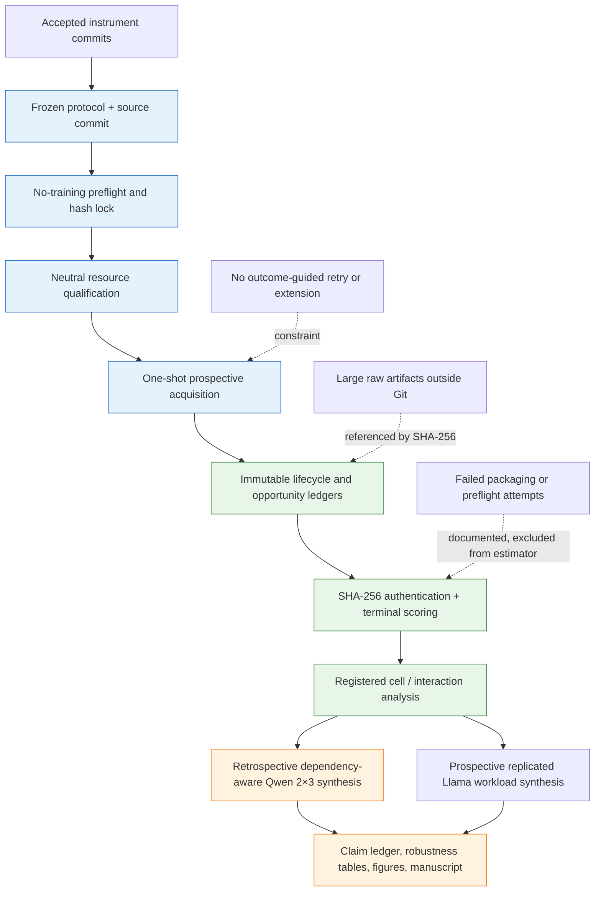

# Provenance diagram

The publication synthesis authenticates the raw ledgers against the preserved
four-cell grid, NuminaMath, and four Llama V5 terminal records before
reconstructing any estimate. It does not consume qualification observations,
add acquisitions, or change registered conclusions. The Llama endpoints remain
separate from the Qwen interaction model.
