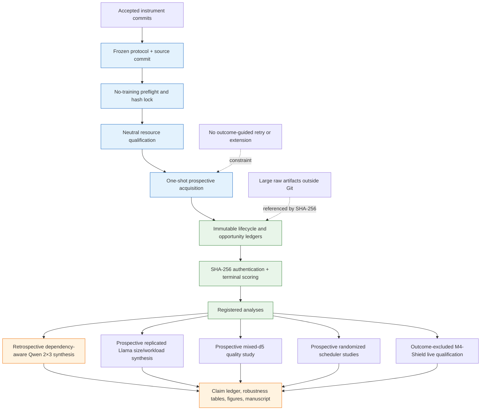

# Provenance diagram

```mermaid
flowchart TD
    I[Accepted instrument commits] --> P[Frozen protocol + source commit]
    P --> F[No-training preflight and hash lock]
    F --> Q[Neutral resource qualification]
    Q --> A[One-shot prospective acquisition]
    A --> R[Immutable lifecycle and opportunity ledgers]
    R --> H[SHA-256 authentication + terminal scoring]
    H --> G[Registered analyses]
    G --> S[Retrospective dependency-aware Qwen 2×3 synthesis]
    G --> L[Prospective replicated Llama size/workload synthesis]
    G --> D[Prospective mixed-d5 quality study]
    G --> O[Prospective randomized scheduler studies]
    G --> K[Outcome-excluded M4-Shield live qualification]
    S --> M[Claim ledger, robustness tables, figures, manuscript]
    L --> M
    D --> M
    O --> M
    K --> M

    N[No outcome-guided retry or extension] -. constraint .-> A
    Z[Large raw artifacts outside Git] -. referenced by SHA-256 .-> R

    classDef frozen fill:#e3f2fd,stroke:#1565c0;
    classDef evidence fill:#e8f5e9,stroke:#2e7d32;
    classDef retrospective fill:#fff3e0,stroke:#ef6c00;
    class P,F,Q,A frozen;
    class R,H,G evidence;
    class S,M retrospective;
```

The publication synthesis authenticates the raw ledgers against the preserved
six-cell Qwen grid, eight Llama controlled-delay records, 32 mixed-d5
quality runs, 20 OARS/FIFO runs, 54 quality-primary scheduler runs, and the
64-decision M4-Shield qualification before reconstructing any estimate.
It does not consume qualification observations, add acquisitions, or change
registered conclusions. The controlled-delay, mixed-d5, and OARS studies retain
their distinct randomization units, endpoints, and registered claim roles.
M4-Shield remains an outcome-excluded systems qualification rather than a
causal estimator.
