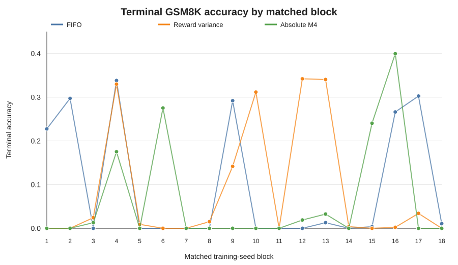
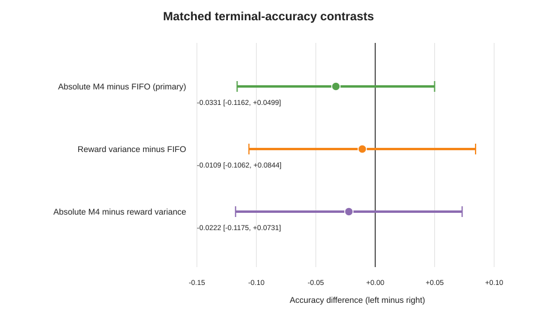

# OARS-v2 quality-primary terminal result

## Conclusion

The preregistered absolute-M4 versus FIFO accuracy criterion was not met. Across
18 matched Llama-3.2-1B/GSM8K blocks, the mean terminal-accuracy difference was
-0.0331, with a two-sided 95% confidence interval from -0.1162 to 0.0499. The
inclusive exact two-sided sign-flip p-value was 0.4038. The study therefore does
not support an absolute-M4 accuracy improvement in this tested 64-update
setting.

Reward-variance scheduling also did not improve terminal accuracy relative to
FIFO: the mean difference was -0.0109 with 95% CI [-0.1062, 0.0844]. The
absolute-M4 minus reward-variance contrast was -0.0222 [-0.1175, 0.0731]. These
are reported as continuous estimates; no post-outcome classification label is
introduced.

The mechanism and systems results are informative. Reward-variance scheduling
increased retained registered L1 opportunity by 311.53 [125.40, 497.66]
relative to FIFO. The absolute-M4 estimate was 215.51 [-7.82, 438.84]. Both
active schedulers reduced time to update 64: geometric-mean ratios were 0.8023
[0.7327, 0.8785] for reward variance and 0.8139 [0.7435, 0.8910] for absolute
M4. Thus a scheduler can move the measured opportunity proxy and wall time
without producing a corresponding terminal-accuracy gain in this design.

## Design and release boundary

The frozen design contained 18 matched training-seed blocks and three acting
policies per block: FIFO, reward variance, and absolute M4. All 54 terminal
records and both copies per identity authenticated before outcome access. The
extractor and analyzer were frozen and pushed at commit `ac0557f6f` while
results remained unopened. Controlled release read only each authenticated
`arm-result.json`; raw evaluation-data payloads remained unopened.

One local archive was absent at the first extraction attempt. The extractor
refused after preserving 48 partial compact results. The missing
`b17-reward-variance` terminal copies were restored from their original jobs,
re-authenticated byte-for-byte against the existing receipt, and the unchanged
committed extractor then released all 54 results. This was an evidence-storage
repair, not a scientific rerun or replacement.

## Registered accuracy estimates

| Contrast | Mean difference | Two-sided 95% CI | Additional registered evidence |
| --- | ---: | ---: | ---: |
| Absolute M4 minus FIFO (primary) | -0.0331 | [-0.1162, 0.0499] | Exact sign-flip p=0.4038 |
| Reward variance minus FIFO | -0.0109 | [-0.1062, 0.0844] | Descriptive secondary |
| Absolute M4 minus reward variance | -0.0222 | [-0.1175, 0.0731] | Descriptive secondary |

Mean terminal accuracies were 0.0973 for FIFO, 0.0863 for reward variance, and
0.0641 for absolute M4. The primary block contrasts comprised six positive,
six zero, and six negative values. Zero-accuracy terminal runs were retained:
9/18 FIFO, 7/18 reward variance, and 11/18 absolute M4. No run was excluded.

## Mechanism, dose, and wall time

| Contrast | Estimate | Two-sided 95% CI |
| --- | ---: | ---: |
| Retained L1, absolute M4 minus FIFO | 215.51 | [-7.82, 438.84] |
| Retained L1, reward variance minus FIFO | 311.53 | [125.40, 497.66] |
| Retained L1, absolute M4 minus reward variance | -96.02 | [-384.49, 192.45] |
| Wall-time ratio, absolute M4/FIFO | 0.8139 | [0.7435, 0.8910] |
| Wall-time ratio, reward variance/FIFO | 0.8023 | [0.7327, 0.8785] |
| Wall-time ratio, absolute M4/reward variance | 1.0145 | [0.9521, 1.0810] |
| Valid-actor-token ratio, absolute M4/FIFO | 1.2446 | [0.8835, 1.7532] |
| Valid-actor-token ratio, reward variance/FIFO | 1.1011 | [0.7689, 1.5767] |
| Valid-actor-token ratio, absolute M4/reward variance | 1.1304 | [0.7920, 1.6133] |

The active policies selected materially different candidate subsets. Mean FIFO
overlap out of four selected groups was 2.476 for absolute M4 and 2.536 for
reward variance, versus four by construction for FIFO. The absolute-M4 minus
reward-variance overlap difference was -0.0608 [-0.1612, 0.0397]. All frozen
policy-compliance checks passed. Mean gradient-observer duty was 0.2261% for
absolute M4, 0.2229% for reward variance, and 0.0599% for FIFO; mean scheduler
decision duty was 0.01084%, 0.01060%, and 0.00756%, respectively.

## Scientific interpretation

This prospective follow-up changes the scheduler claim. The earlier 10-pair
OARS study reported a positive secondary accuracy estimate, but its registered
opportunity-retention endpoint was imprecise. In the larger three-arm study,
reward variance moved retained opportunity clearly and both active policies
reduced wall time, yet neither improved terminal accuracy. The combined
evidence supports three narrower statements:

1. The opportunity signal is actionable enough to change selection and measured
   retained opportunity.
2. Naively maximizing an opportunity proxy does not guarantee higher terminal
   quality.
3. Scheduler effects are heterogeneous and require prospective quality-primary
   evaluation rather than inference from proxy movement alone.

The study does not identify mediation, establish practical equivalence, or
support deployment of either active policy. It covers one model, one workload,
one 64-update horizon, and one execution environment.

## Verification and provenance

- Completion audit SHA-256: `d1f5dd6166408f5db1586ba0d0bec1d9c231058fcf2706d969d247dffb887268`
- Blind analyzer commit: `ac0557f6f`
- Extraction receipt SHA-256: `991f53830ed6f6a0544da5572e9584c05c36b46646c5bf867a7e15e4f0046397`
- Analysis result SHA-256: `17490153ef9521a830e5538423479c6d4af6bbd03c58bcbcf3aa5663973faa52`
- Common GSM8K prompt-manifest SHA-256: `81d89a2c6a2fcf8012cf2e6520cec3a420d3ac68c66c48bb9ee2ebeee096b53e`

The machine-readable analysis reproduced byte-for-byte on a second invocation.
An independent Ruby standard-library implementation matched all arm means,
accuracy contrasts and intervals, wall-time and token ratios, retained-L1
contrasts, and the exhaustive sign-flip p-value.
